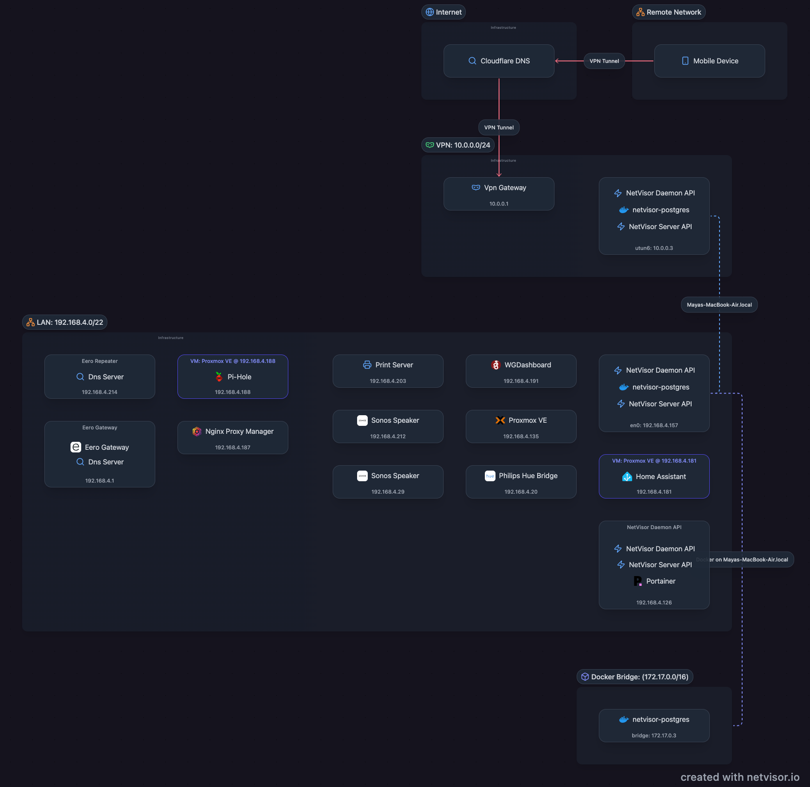
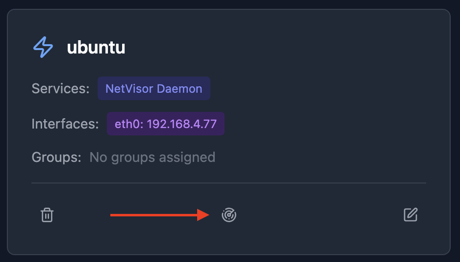

# NetVisor

**Automatically discover and visually document network topology.**

NetVisor scans your network, identifies hosts and services, and generates an interactive visualization showing how everything connects, letting you easily create and maintain network documentation.

<p align="center">
  
</p>

## Table of Contents

- [0. Installation](#installation)
- [1. Discover hosts on the network](#network-discovery)
- [2. Organize hosts](#network-organization)
- [3. Generate a visualization](#topology-visualization)
- [Uninstall Daemon](#uninstall-daemon)
- [FAQ](#faq)
  - [Are VLANs supported?](#are-vlans-supported)
  - [Is IPv6 supported?](#is-ipv6-supported)

## Installation

### 0. Install Requirements

#### Daemon
- **Linux**: Docker with host networking support, OR binary installation
- **Mac/Windows**: Binary installation only (Docker Desktop does not support host networking)

#### Server (Docker - Recommended)
- Docker
- Docker Compose

#### Server (Building from source)
- Rust 1.90 or later
- Node.js 20 or later

### 1. Start the Server

```bash
curl -O https://raw.githubusercontent.com/mayanayza/netvisor/refs/heads/main/docker-compose.yml && docker compose up -d
```

The server collects data from the daemon(s) and generates the topology visualization. The server can support multiple daemon instances in case you want to collect data from the perspective of multiple hosts on your network (ie - mapping out vlans).

### 2. Install the Daemon  

The daemon scans the network and requires access to host network interfaces. 

**Linux**: Can run in Docker with `--network host` and `--privileged` flags, or as a binary directly on the host.

**Mac/Windows**: Docker Desktop does not support host networking, so the daemon must run as a binary directly on the host (not containerized).

#### Linux (Docker - Recommended)

Make sure to replace YOUR_SERVER_IP

```bash
curl -O https://raw.githubusercontent.com/mayanayza/netvisor/refs/heads/main/docker-compose.daemon.yml && \
NETVISOR_SERVER_TARGET=YOUR_SERVER_IP docker compose -f docker-compose.daemon.yml up -d
```

#### Linux (Binary)

```bash
curl -sSL https://raw.githubusercontent.com/mayanayza/netvisor/refs/heads/main/install.sh | bash
```

#### Mac / Windows (Binary)

```bash
curl -sSL https://raw.githubusercontent.com/mayanayza/netvisor/refs/heads/main/install.sh | bash
```

### 3. Connect Daemon to Server

If you installed the daemon as a binary (not using Docker), run:

```bash
netvisor-daemon --server-target YOUR_SERVER_IP --server-port 60072
```

If you used the Docker command above, the daemon is already connected and running.

## Discover hosts on the network

Once you connect a daemon to the server, a host will be created with a discovery button. Click to start discovery.

<p align="center">
  
</p>

The NetVisor Daemon discovers hosts on your network by scanning all IPv4 addresses on subnets that the host it runs on has a network interface with. For each IP on the network, the daemon:

- **Detects services**: Uses rule based pattern matching to recognize running services using open ports, HTTP endpoints responses, and other data from the host.
- **Maps interfaces**: Detects host network interfaces and their subnet membership

Discovery creates hosts with their interfaces, services, and subnet relationships.

Discovery can take 5-10+ minutes depending on how many subnets the daemon's host is connected and the network mask for those subnets, as it needs to scan every IP address on the subnet.

## Organize hosts

### Consolidating Hosts

The discovery process does its best to merge duplicate hosts, but this isn't always possible. You can consolidate hosts that actually represent multiple interfaces or services on the same host using the Consolidate feature. This migrates all ports, interfaces, and services to a single host record.

<p align="center">
  
</p>


### Subnets

Subnets organize your network into logical segments of hosts. Subnets are automatically created during discovery.

<p align="center">
  
</p>

### Groups

Groups let you visualize logical connections between services, such as a web app talking to its database, or representing network paths between different parts of your infrastructure. You'll need to create groups manually.

<p align="center">
  
</p>

**Infrastructure Services**: During discovery, hosts providing infrastructure services (DNS, gateway, reverse proxy) services are flagged for visualization purposes.

**Organizational Subnets**: Subnets with 0.0.0.0/0 CIDR can be used to organize external resources (like internet services or remote hosts) that aren't on your local network but you want to include in your topology.

## Generate a visualization

The topology auto-generates from your hosts, subnets, and service groups, creating living documentation that updates as your network changes.

You can customize the visualization:
- **Anchor points**: Click edges to change where they connect to nodes
- **Subnet sizing**: Drag subnet boundaries to resize
- **Layout**: Drag hosts and subnets to organize your topology

## Uninstall Daemon

#### Linux (Docker)

```bash
docker stop netvisor-daemon
docker rm netvisor-daemon
```

#### Linux (Binary)

```bash
sudo rm /usr/local/bin/netvisor-daemon
rm -rf ~/.config/netvisor/daemon
```

#### Mac (Binary)

```bash
sudo rm /usr/local/bin/netvisor-daemon
rm -rf ~/Library/Application\ Support/com.netvisor.daemon
```

## FAQ

### Are VLANs supported?

Yes, you can collect information from hosts on multiple vlans by using multiple Daemon deployments. Simply install a daemon on a host that interfaces with each vlan you want to include in the visualization. You will probably need to use the [Consolidate](#consolidating-hosts) feature to combine IPs which are detected as distinct hosts.

### Is IPv6 supported?

Not currently. Future plans to support IPv6 will focus on collecting a host's IPv6 address during discovery and/or allowing manual entry of it during editing. Scanning the entire IPv6 space of a discovered subnet will never be supported as it will take too long to do so.