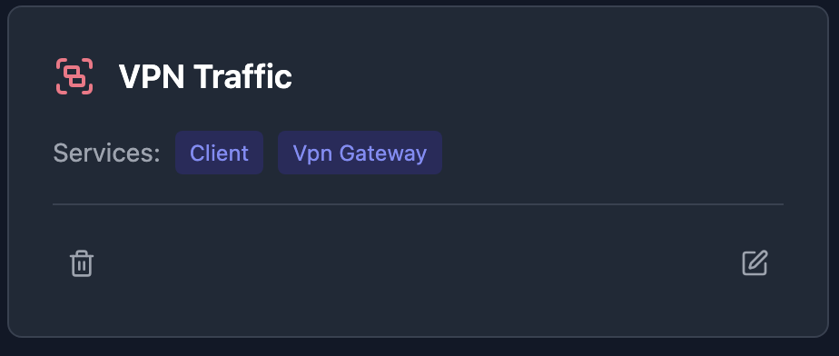
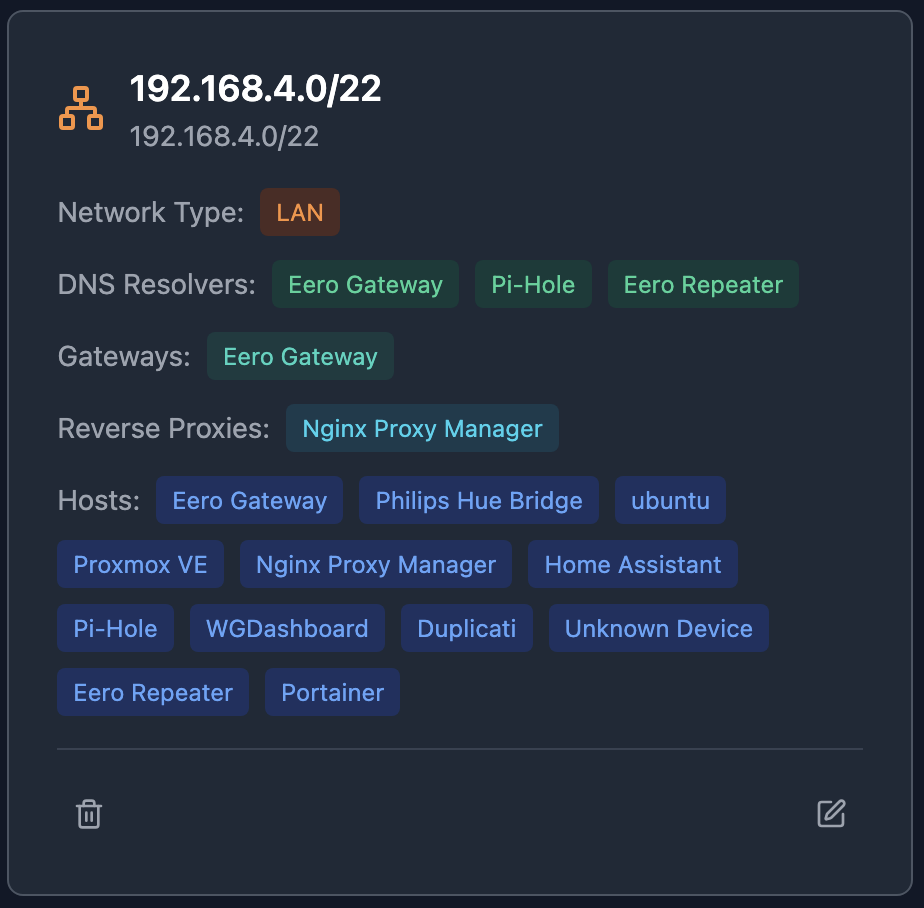

# NetVisor

Network discovery and topology visualization for home labs and small networks.

## Quick Start

### 1. Start the Server
`curl -O https://raw.githubusercontent.com/mayanayza/netvisor-server/refs/heads/main/docker-compose.yml && docker compose up -d`

### 2. Install the Daemon  
`curl -sSL https://raw.githubusercontent.com/mayanayza/netvisor-server/refs/heads/main/install.sh | bash`

The daemon should run directly on the host - running in a container environment will compromise discovery functionality.

### 3. Connect Daemon to Server
`netvisor-daemon --server-target YOUR_SERVER_IP --server-port 60072`

## Network Discovery

Once you connect a daemon to the server, a host will be created with a discovery button. Click to start discovery.

{width=600px}

The NetVisor Daemon discovers hosts on your network by scanning all ipv4 addresses on subnets that the host it runs on has a network interface with. For each IP on the network, the daemon:

- **Detects services**: Uses rule based pattern matching to recognize running services using open ports, HTTP endpoints responses, and other data from the host.
- **Maps interfaces**: Detects host network interfaces and their subnet membership

Discovery creates hosts with their interfaces, services, and subnet relationships.

### Consolidating Hosts
The discovery process does its best to merge duplicate hosts, but this isn't always possible. You can consolidate hosts that actually represent multiple interfaces or services on the same host using the Consolidate feature. This migrates all ports, interfaces, and services to a single host record.

{width=600px}

## Network Organization

### Groups
You can use Groups to represent data flows between services and network paths.

{width=600px}

### Subnets
Subnets organize your network into logical segments of hosts.

{width=600px}

**Infrastructure Services**: During discovery, host providing infrastructure services (DNS, gateway, reverse proxy) services are flagged for visualization purposes.

**Organizational Subnets**: Subnets with 0.0.0.0/0 CIDR can be used to organize hosts that are outside of your network but which you still want to represent in your network topology (ie internet services, remote hosts)

## Topology Visualization

Using the information above, NetVisor generates an interactive network graph showing:
- Hosts and their relationships
- Subnet boundaries and containment
- Service connections within groups
- Multi-interface devices (interfaces connected to primary)

The topology auto-generates from your hosts, subnets, and service groups.

You can customize the visualization as follows:
- Change the anchor point of edges by clicking on the edge.
- Resize subnets
- Move hosts and subnets