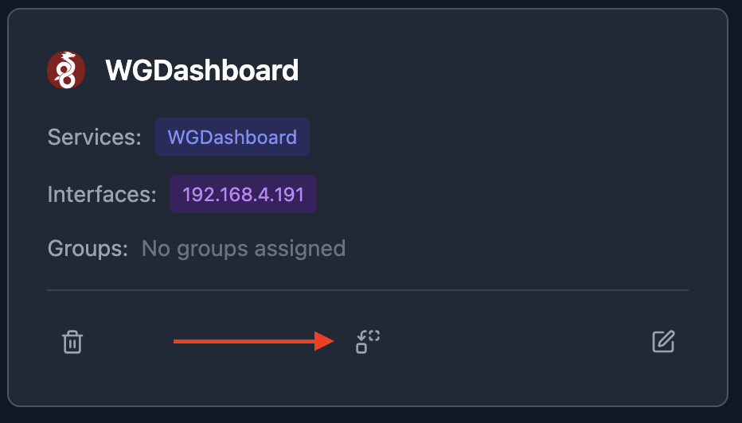

# NetVisor

**Automatically discover and visually document network topology.**

NetVisor scans your network, identifies hosts and services, and generates an interactive visualization showing how everything connects, letting you easily create and maintain network documentation.

## Quick Start

### 1. Start the Server
`curl -O https://raw.githubusercontent.com/mayanayza/netvisor-server/refs/heads/main/docker-compose.yml && docker compose up -d`

The server collects data from the daemon(s) and generates the topology visualization. The server can support multiple daemon instances in case you want to collect data from the perspective of multiple hosts on your network.

### 2. Install the Daemon  
`curl -sSL https://raw.githubusercontent.com/mayanayza/netvisor-server/refs/heads/main/install.sh | bash`

The daemon is used to scan the network and should run directly on the host to access host network interfaces - running in a containerized environment will compromise discovery functionality. Running in a VM or other virtualization is fine.

### 3. Connect Daemon to Server
`netvisor-daemon --server-target YOUR_SERVER_IP --server-port 60072`

## Network Discovery

Once you connect a daemon to the server, a host will be created with a discovery button. Click to start discovery.

  

The NetVisor Daemon discovers hosts on your network by scanning all IPv4 addresses on subnets that the host it runs on has a network interface with. For each IP on the network, the daemon:

- **Detects services**: Uses rule based pattern matching to recognize running services using open ports, HTTP endpoints responses, and other data from the host.
- **Maps interfaces**: Detects host network interfaces and their subnet membership

Discovery creates hosts with their interfaces, services, and subnet relationships.

Discovery can take tens of minutes depending on how many subnets the daemon's host is connected and the network mask for those subnets, as it needs to scan every IP address on the subnet.

### Consolidating Hosts
The discovery process does its best to merge duplicate hosts, but this isn't always possible. You can consolidate hosts that actually represent multiple interfaces or services on the same host using the Consolidate feature. This migrates all ports, interfaces, and services to a single host record.

  

## Network Organization

### Subnets
Subnets organize your network into logical segments of hosts. Subnets are automatically created during discovery.

  

### Groups
Groups let you visualize logical connections between services, such as a web app talking to its database, or representing network paths between different parts of your infrastructure. You'll need to create groups manually.

  

**Infrastructure Services**: During discovery, hosts providing infrastructure services (DNS, gateway, reverse proxy) services are flagged for visualization purposes.

**Organizational Subnets**: Subnets with 0.0.0.0/0 CIDR can be used to organize external resources (like internet services or remote hosts) that aren't on your local network but you want to include in your topology.

## Topology Visualization
The topology auto-generates from your hosts, subnets, and service groups, creating living documentation that updates as your network changes.

You can customize the visualization:
- **Anchor points**: Click edges to change where they connect to nodes
- **Subnet sizing**: Drag subnet boundaries to resize
- **Layout**: Drag hosts and subnets to organize your topology

## Uninstall Daemon

#### Linux

sudo rm /usr/local/bin/netvisor-daemon
rm -rf ~/.config/netvisor/daemon

#### Mac

sudo rm /usr/local/bin/netvisor-daemon
rm -rf ~/Library/Application\ Support/com.netvisor.daemon